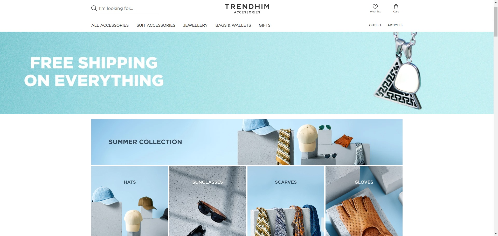
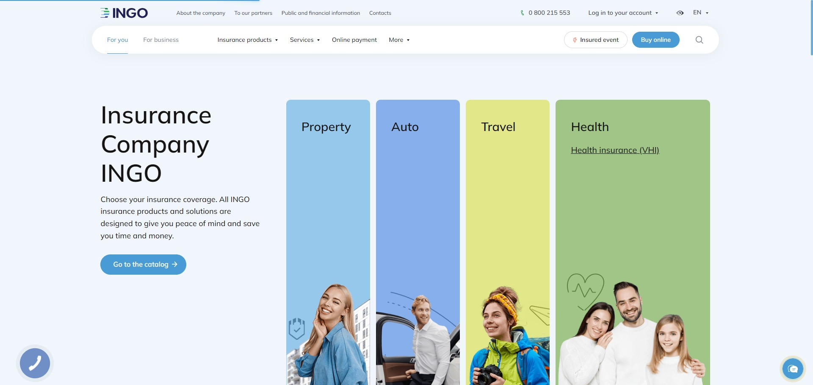
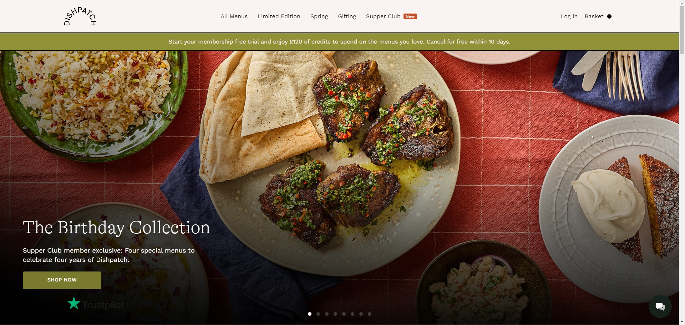

<!DOCTYPE html>
<html>
<head>
<link rel="stylesheet" href="style.css">
</head>
<h1>👋 Hi there! I'm a Senior React Developer with 4+ Years of Expertise</h1>

🚀 Passionate about creating intuitive user experiences and building robust, performant web applications with React, Next.js, and TypeScript. I'm a problem-solver with a talent for turning ideas into beautiful, functional code.

<h2>🔧 Tech Stack Highlights</h2>

<ul>
    <li>Frontend: React/React Native, Next.js, TypeScript, JavaScript, HTML, CSS, Redux, Material UI, Tailwind CSS, Bootstrap</li>
    <li>Backend: Node.js, Express.js, RESTful APIs</li>
    <li>Databases: MySQL, PostgreSQL, MongoDB, Firebase, Supabase</li>
    <li>Other: Git, GitHub, Agile methodologies, Responsive Design</li>
</ul>

<h2>🎯 What I Offer</h2>

<ul>
    <li>UI/UX Excellence: Passionate about creating intuitive, visually appealing, and responsive interfaces.</li>
    <li>Full-Stack Proficiency: Experienced in both frontend and backend technologies, ensuring seamless integration and a smooth development process.</li>
    <li>Data Expertise: Comfortable handling complex data interactions, APIs, and state management for optimal performance.</li>
    <li>Collaborative Approach:  Team player with excellent communication skills and a passion for delivering successful projects.</li>
    <li>Eager to Learn: Always seeking to expand my skill set with new technologies and frameworks.</li>
</ul>

<h2>💼 Portfolio Highlights</h2>

    
<table>
  <tr>
    <td>
      

        <h3><a href="https://gepur.com/uk">GEPUR</a></h3>
        
Led frontend development for this stylish women's apparel e-commerce site, crafting core pages and shopping features for a seamless user experience.

      

    </td>
    <td align="right" style="padding: 0;">
      
    </td>
  </tr>
  <tr>
    <td>
      

        <h3><a href="https://www.trendhim.com/">Trendhim</a></h3>
        
Developed and maintained key features for this popular men's accessories eCommerce store. Utilized React, Next.js, and Node.js to create a visually appealing and highly functional interface, ensuring a smooth shopping experience for customers.

      

    </td>
    <td align="right">
      
    </td>
  </tr>
  <tr>
    <td>
      

        <h3><a href="https://ingo.ua/">INGO</a></h3>
        
Enhanced the user experience of this insurance platform with intuitive UI/UX components and robust Node.js-based user authentication.

      

    </td>
    <td align="right">
      
    </td>
  </tr>
  <tr>
    <td>
      

        <h3><a href="https://dishpatch.co.uk/">Dishpatch</a></h3>
        
Built a visually appealing and dynamic menu website with real-time order updates using React, Next.js, and Tailwind CSS.

      

    </td>
    <td align="right">
      
    </td>
  </tr>
</table>

<h2>🤝 Let's Connect!</h2>

Interested in collaborating on your next project? Feel free to reach out!

<ul>
    <li>Upwork: <a href="https://www.upwork.com/freelancers/~0181b03ee636205c0e?mp_source=share">Bohdan Oleshko</a></li>
</ul>

Let's build something amazing together! 🚀

</body>
</html>
